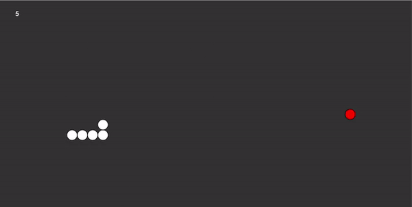

# Snake
This is a games that uses the mechanics of the popular game Snake. written in JavasCript using the library P5.js
## Functionality
It works as it should, you can play the original game. When you eat an apple, your score goes up, when you press the arrows, it goes in that direction and when you collide with either the wall or the snake itself, you lose.
## How to run
  * Download the file 
  * Extract it anywhere
  * Open the index.html
  * You should see the game running!
## Video Example

